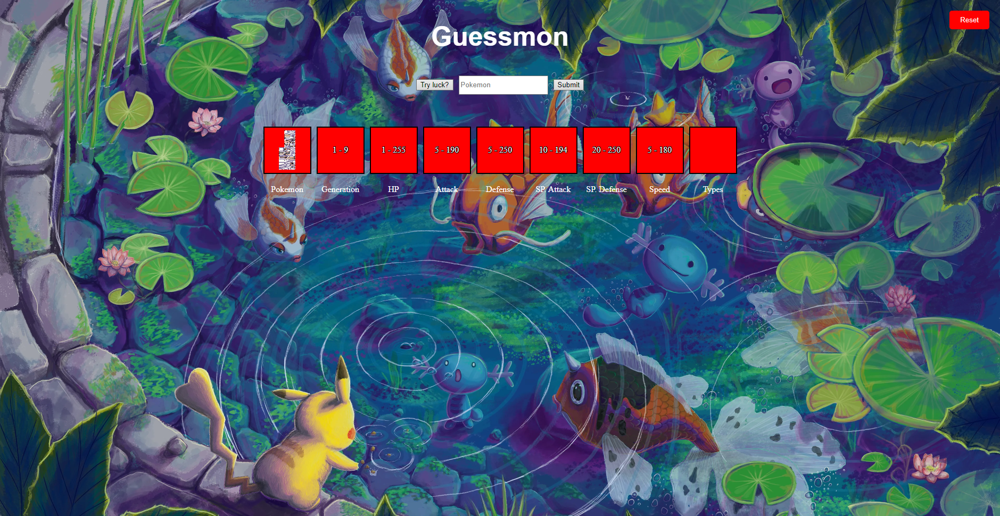
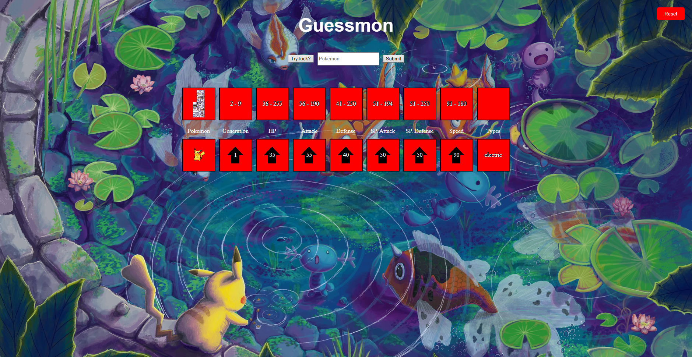
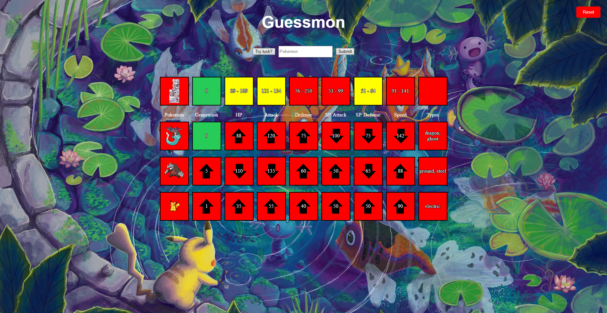
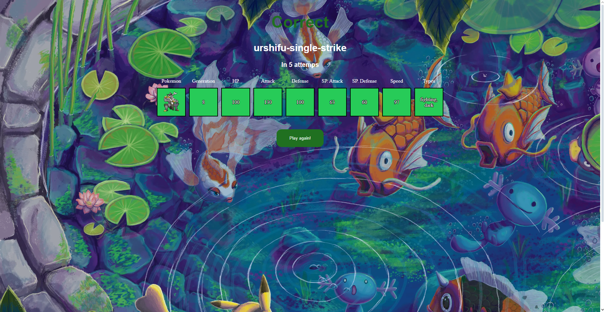

# 🌟 GuessMon
Welcome to GuessMon! This is an exciting Pokémon guessing game where you can test your knowledge about these legendary creatures. Try to guess the correct Pokémon based on the provided clues and improve your score!

## 🕹️ Main Features 
- Guess the Pokémon: Based on the clues given, guess which Pokémon it is.
- User-Friendly Interface: Simple and intuitive design for an enjoyable gaming experience.
- Scoring: Compete with your friends to see who can guess the Pokémon in the fewest attempts.

## 💻 Technologies Used 
- Python
- Flask
- HTML
- CSS
- JavaScript
- PokeAPI

## 📸 Screenshots

